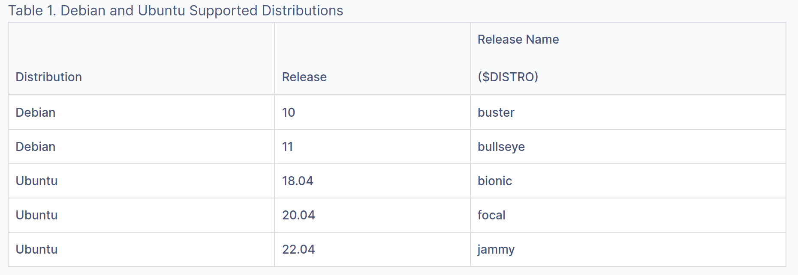

# Tutorial de comandos mas usados en Linux(Debian, Ubuntu) con OpenVpn

## Descarga de OpenVpn3 en Linux

-[OpenVpn 3 Client for Linux](https://openvpn.net/cloud-docs/owner/connectors/connector-user-guides/openvpn-3-client-for-linux.html)

Primero insertamos estos comandos, y sobre todo en el segundo estaremos atentos a nuestra dsitrubución para después cambiar el comando de instalación de nuestro repositorio.
```ruby
$ curl -fsSL https://swupdate.openvpn.net/repos/openvpn-repo-pkg-key.pub | gpg --dearmor | sudo tee /etc/apt/trusted.gpg.d/openvpn-repo-pkg-keyring.gpg

$ DISTRO=$(lsb_release -c | awk '{print $2}')
```
Si tu distribución(Debian, Ubuntu), no se encuentra en el listado y es una distro basada en las dos citadas, busca en cual de estas dsitribuciones se basa. En el siguiente comando cambia tu $DISTRO, por tu nombre de distribución correspondiente.


```ruby
$ sudo curl -fsSL https://swupdate.openvpn.net/community/openvpn3/repos/openvpn3-$DISTRO.list -o /etc/apt/sources.list.d/openvpn3.list

$ sudo apt update

$ sudo apt install openvpn3
```

Una vez hecha la instalación, podremos iniciar sesión con el siguiente comando, haciendo alusión al archivo de configuración .ovpn
```ruby
$ openvpn3 session-start --config ${MY_CONFIGURATION_FILE}
```
Con los siguientes comandos podremos gestionar las sesiones abiertas en estos momentos y cerrarlas a nuestro antojo.
```ruby
$ openvpn3 sessions-list
$ openvpn3 session-manage --session-path /net/openvpn/v3/sessions/..... --disconnect
```